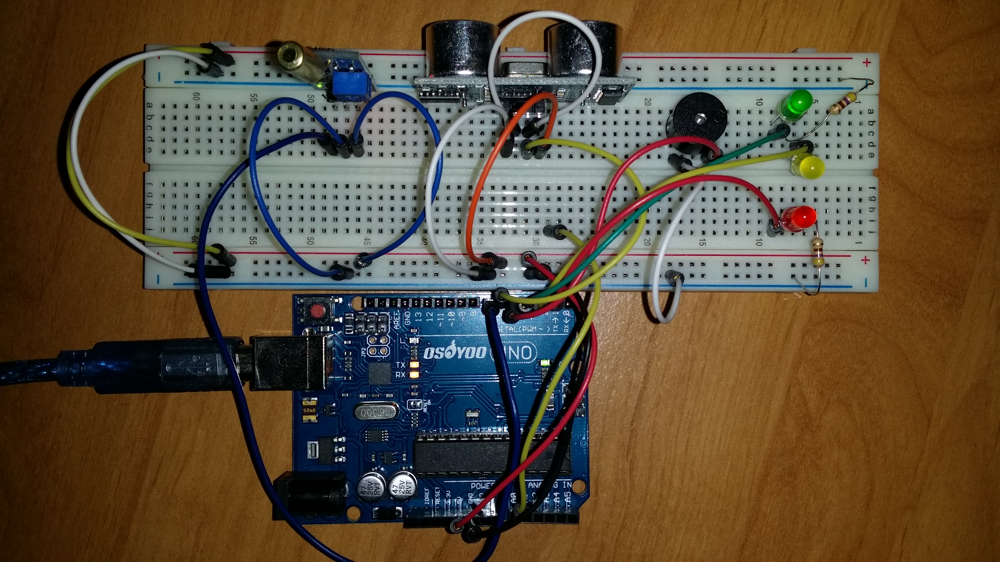
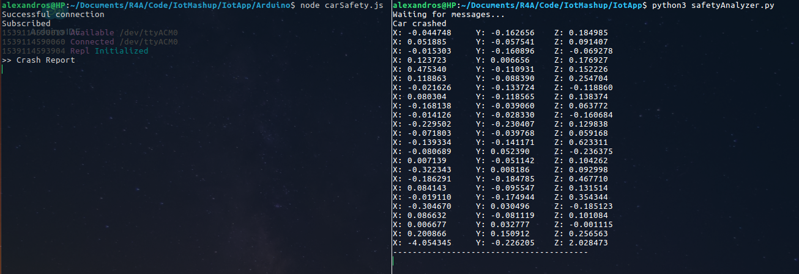
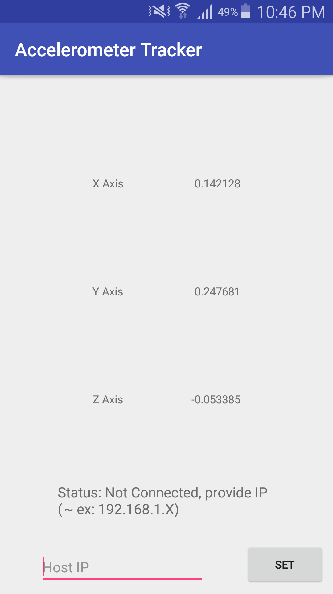
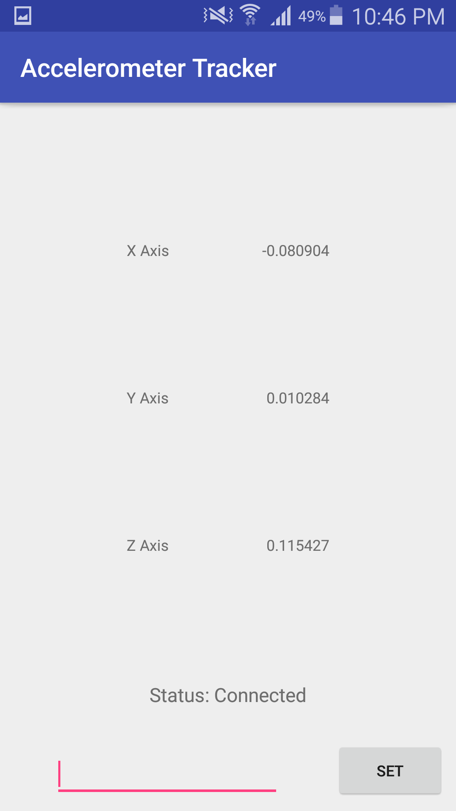

# Iot Mashup

This project was built in order to gain a better understanding of the practical use of some IoT protocols and to gain an experience on using middlewares that provide an abstraction layer, helping to shift the focus from the connection and communication between different devices/platforms to the logic of the implementation.

For that purpose, [RabbitMQ](https://www.rabbitmq.com/) was used as a server/broker and [Johnny-Five](http://johnny-five.io/) as a framework to access device resources.

# Mashup Concept

The whole system simulates a car and driver safety system. The arduino simulates the car, with an ultrasonic sensor measuring the distance from an obstacle, informing the driver by sound (piezometer) and light (LEDs). The added tilt sensor simulates an impact sensor. Whenever it detects a crash, it publishes an update to a topic to which the PC is subscribed. The PC then, asks from the driver's phone for accelerometer data. It analyzes the data and if there is movement detected it  concludes that the driver is safe.

## Devices

Three devices were used:
- **PC** for analyzing data and coordination of the tasks
- **Arduino Uno** for collecting data and interacting with the real world
- **Android Phone** for sending data on demand

## Protocols

Two protocols were used:
- **MQTT** for a more lightweight communication (Arduino & Android Phone)
- **AMQP** for the non resource-constrained PC

## Programming Languages:

- **Python** running on the PC
- **Java** for the Android programming
- **JS** taking advantage of the Johnny-Five framework for easier access and control of the arduino

## Screenshots

### Photo from the arduino setup:

### Screenshot from the desktop app:

### Screenshots from the mobile app:

      

## Comments

Leveraging existing infrastructure we managed to achieve high interoperability between different devices, protocols and programming languages, enabling us to use these tools for future projects considering the experience gained. 

## Resources

https://www.rabbitmq.com/

http://johnny-five.io/
